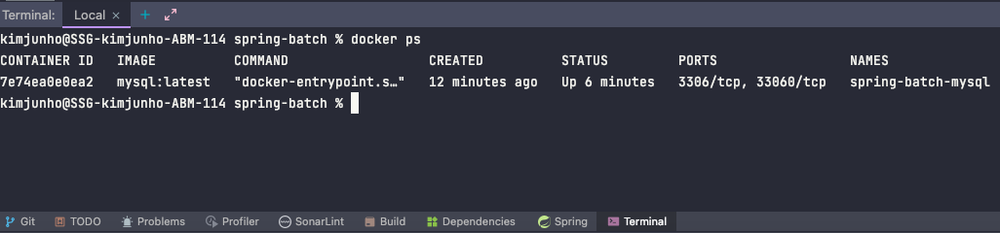
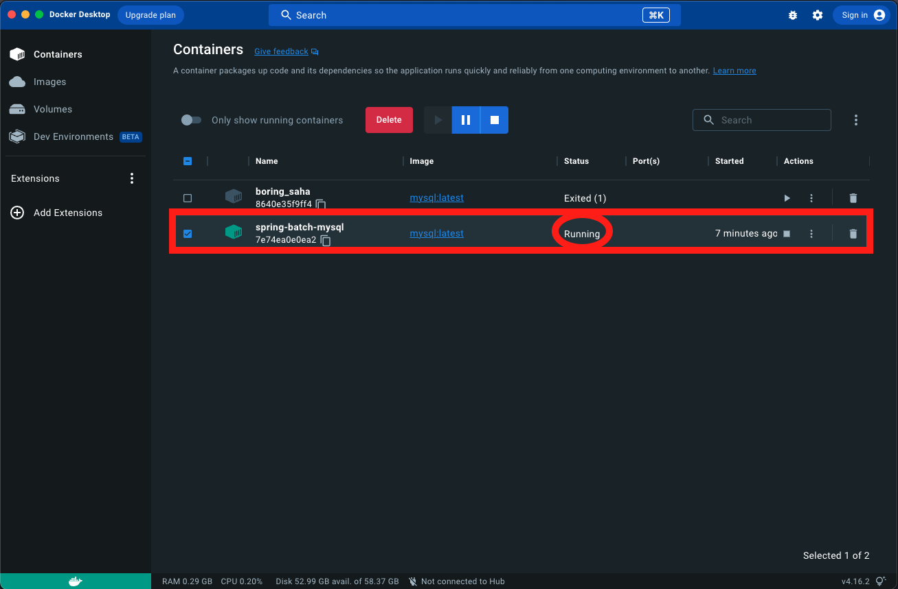
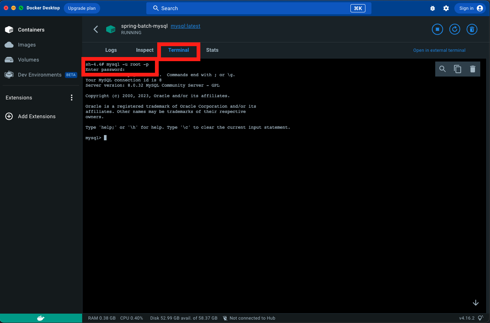
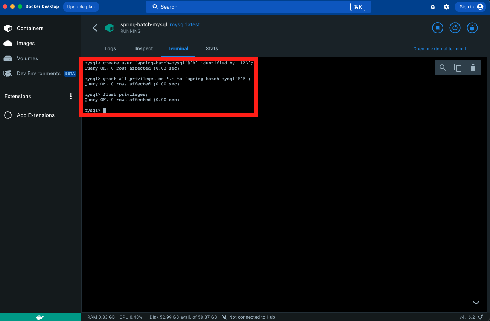
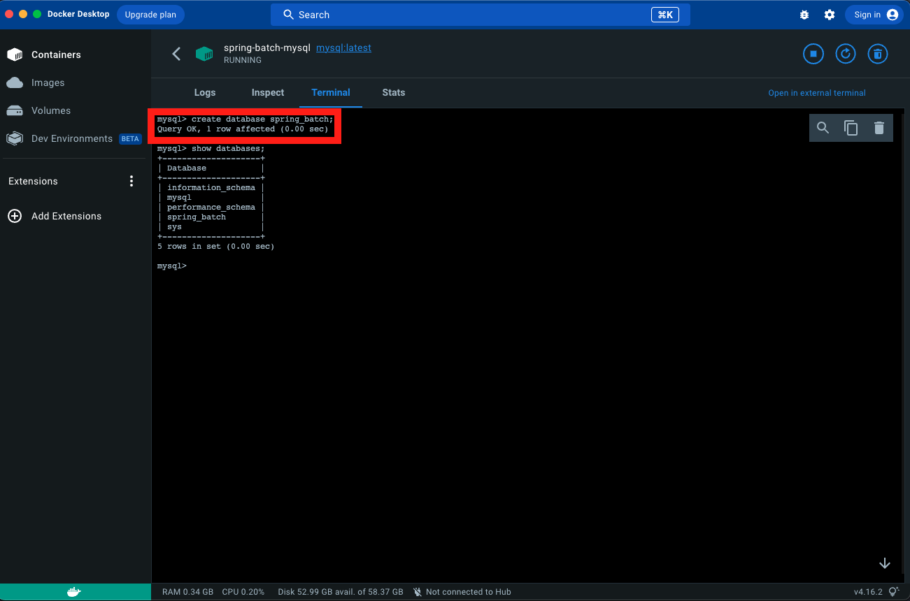
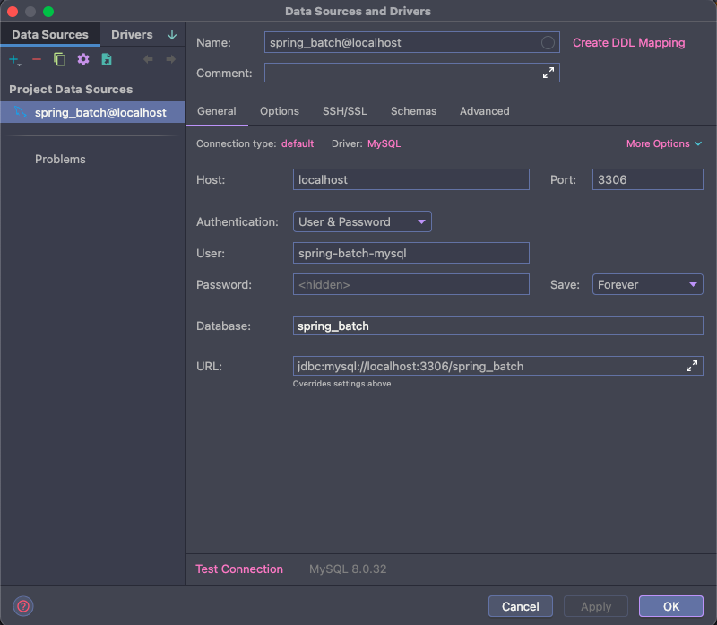
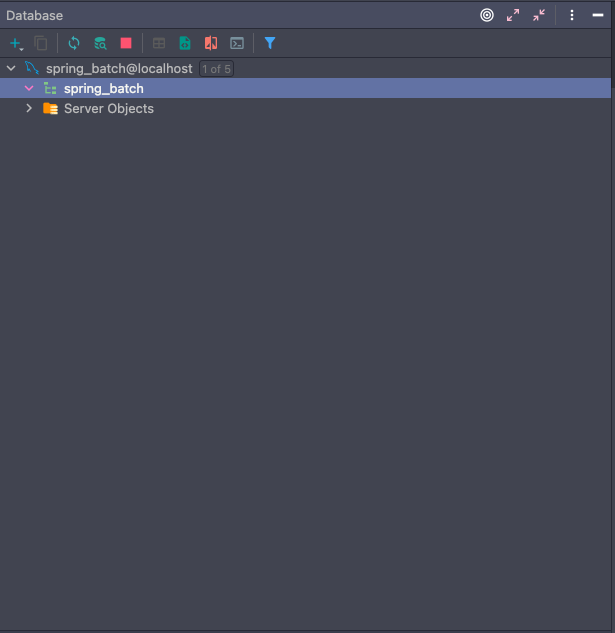

## spring-batch 의존성 추가 - pom.xml 설정

````xml
<!-- spring-batch -->
<dependency>
    <groupId>org.springframework.boot</groupId>
    <artifactId>spring-boot-starter-batch</artifactId>
</dependency>
````

## MySQL 설치

> Docker 설치

- Docker 설치 : https://www.docker.com/get-started
  - Download for Mac - Apple Chip

> Docker - MySQL 이미지 검색 및 다운로드

- tag : 8.0 선택


> Docker - MySQL 이미지 확인


> Docker - MySQL : RUN

- 옵션 셋팅
  - Ports
    - 3306, 3306 설정
  - Container name, Environment variables (이미지명, MySQL 패스워드, MySQL 유저, MySQL DB)


> Docker - MySQL 이미지 재실행

- 좌측 Container 탭 클릭 및 'spring-batch-mysql' 이미지 체크 후 Actions 실행


> Docker - MySQL 실행 확인




## MySQL - user, database 설정

> Terminal 탭 이동 및 MySQL 서버 접속 (패스워드 : MySQL 설치 시 위에서 설정한 패스워드 입력)



> user 설정 및 권한 부여

````sql
# 사용자 생성
create user '사용자이름'@'%' identified by '비밀번호';

# 사용자 권한 부여
grant all privileges on *.* to '사용자이름'@'%';

# 권한 적용
flush privileges;
````



> 데이터베이스 생성

- 'spring_batch' 생성 및 생성 확인

````sql
# 데이터 베이스 생성
create database spring_batch;

# 데이터 베이스 확인
show databases;
````

> 데이터베이스 사용

````sql
use spring_batch;
````



> 인텔리제이 접속 확인

- user, password, database 입력
    - user 설정 및 권한 부여에서 생성한 user / password 입력



