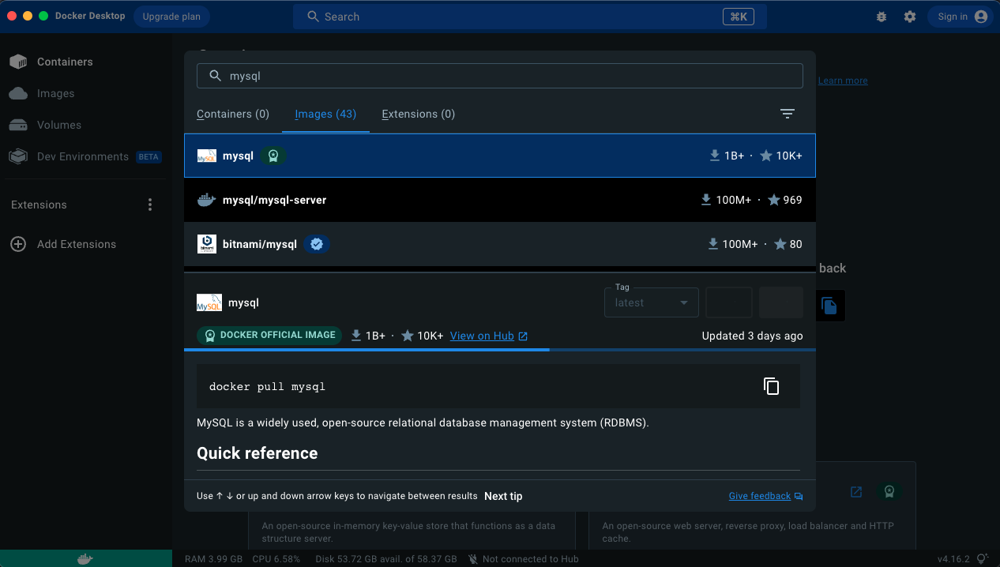
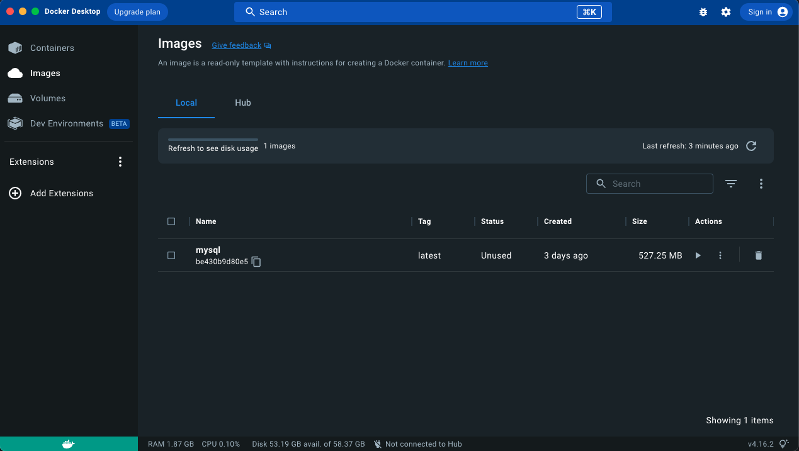
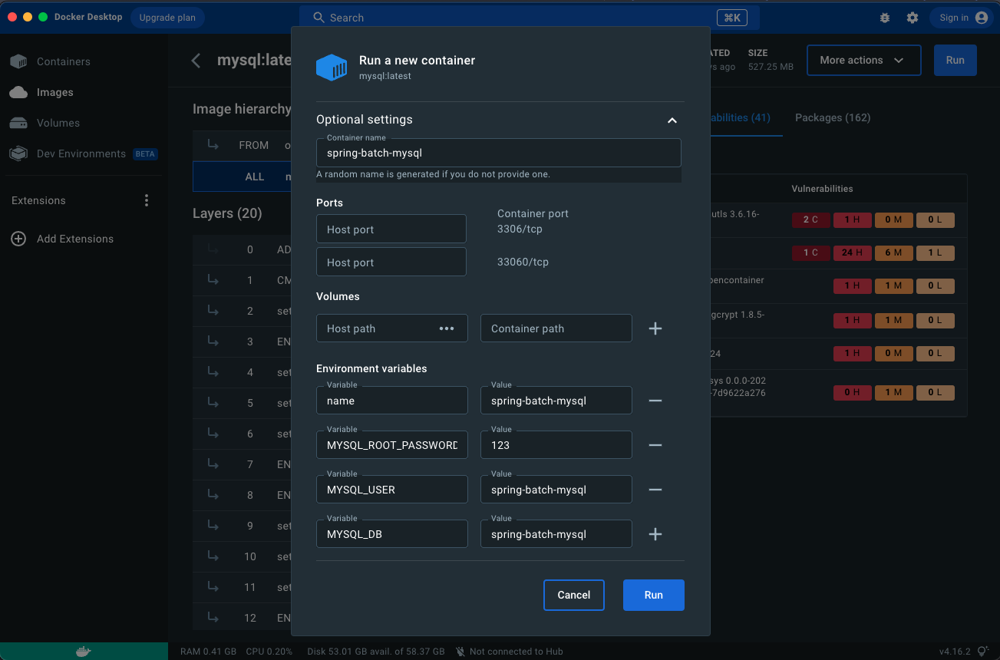
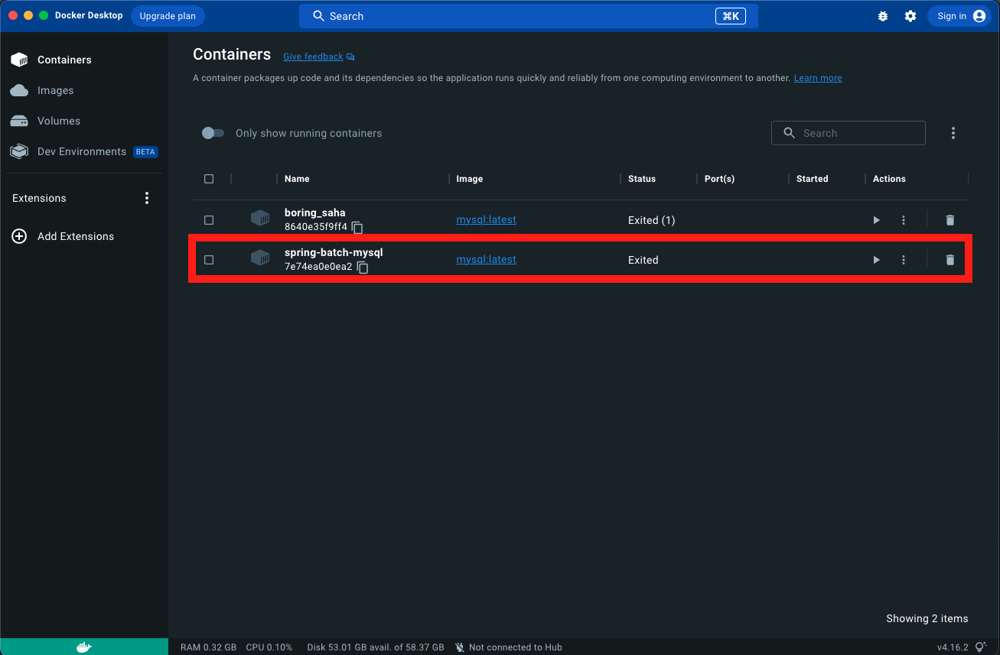

## spring-batch 의존성 추가 - pom.xml 설정

````xml
<!-- spring-batch -->
<dependency>
    <groupId>org.springframework.boot</groupId>
    <artifactId>spring-boot-starter-batch</artifactId>
</dependency>
````

## MySQL 설치

> Docker 설치 및 MySQL 이미지 다운/실행

- Docker 설치 : https://www.docker.com/get-started
    - Download for Mac - Apple Chip

> Docker - MySQL 이미지 검색 및 다운로드



> Docker - MySQL 이미지 확인



> Docker - MySQL : RUN

- 옵션 셋팅
    - Container name, Environment variables (이미지명, MySQL 패스워드, MySQL 유저, MySQL DB)



> Docker - MySQL 이미지 재실행



- 위에서 생성한 MySQL 이미지 재사용
    - spring-batch-mysql 이미지 체크 후 Actions 의 실행 버튼 클릭


