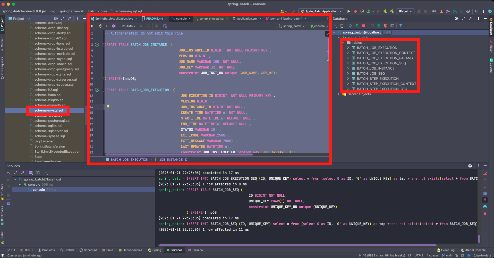

## spring-batch 의존성 추가 - pom.xml 설정

````xml
<!-- spring-batch -->
<dependency>
    <groupId>org.springframework.boot</groupId>
    <artifactId>spring-boot-starter-batch</artifactId>
</dependency>
````

## MySQL 설치

> Docker 설치

- Docker 설치 : https://www.docker.com/get-started
  - Download for Mac - Apple Chip

> Docker - MySQL 이미지 검색 및 다운로드

- tag : 8.0 선택


> Docker - MySQL 이미지 확인


> Docker - MySQL : RUN

- 옵션 셋팅
  - Ports
    - 3306, 3306 설정
  - Container name, Environment variables (이미지명, MySQL 패스워드, MySQL 유저, MySQL DB)


> Docker - MySQL 이미지 재실행

- 좌측 Container 탭 클릭 및 'spring-batch-mysql' 이미지 체크 후 Actions 실행


> Docker - MySQL 실행 확인


## MySQL - user, database 설정

> Terminal 탭 이동 및 MySQL 서버 접속 (패스워드 : MySQL 설치 시 위에서 설정한 패스워드 입력)


> user 설정 및 권한 부여

````sql
# 사용자 생성
create user '사용자이름'@'%' identified by '비밀번호';

# 사용자 권한 부여
grant all privileges on *.* to '사용자이름'@'%';

# 권한 적용
flush privileges;
````


> 데이터베이스 생성

- 'spring_batch' 생성 및 생성 확인

````sql
# 데이터 베이스 생성
create database spring_batch;

# 데이터 베이스 확인
show databases;
````

> 데이터베이스 사용

````sql
use spring_batch;
````


> 인텔리제이 접속 확인

- user, password, database 입력
  - user 설정 및 권한 부여에서 생성한 user / password 입력


> 스프링 배치 메타 데이터 : 수동 테이블 생성 방법

- External Libraries > org.springframework.batch:spring-batch-core:5.0.0 > org.springframework.batch.core

  - schema-mysql.sql 쿼리 복사
- 로컬 MySQL 데이터베이스에 해당 쿼리 붙여넣기를 통한 테이블 생성

````sql
-- Autogenerated: do not edit this file

CREATE TABLE BATCH_JOB_INSTANCE  (
	JOB_INSTANCE_ID BIGINT  NOT NULL PRIMARY KEY ,
	VERSION BIGINT ,
	JOB_NAME VARCHAR(100) NOT NULL,
	JOB_KEY VARCHAR(32) NOT NULL,
	constraint JOB_INST_UN unique (JOB_NAME, JOB_KEY)
) ENGINE=InnoDB;

CREATE TABLE BATCH_JOB_EXECUTION  (
	JOB_EXECUTION_ID BIGINT  NOT NULL PRIMARY KEY ,
	VERSION BIGINT  ,
	JOB_INSTANCE_ID BIGINT NOT NULL,
	CREATE_TIME DATETIME(6) NOT NULL,
	START_TIME DATETIME(6) DEFAULT NULL ,
	END_TIME DATETIME(6) DEFAULT NULL ,
	STATUS VARCHAR(10) ,
	EXIT_CODE VARCHAR(2500) ,
	EXIT_MESSAGE VARCHAR(2500) ,
	LAST_UPDATED DATETIME(6),
	JOB_CONFIGURATION_LOCATION varchar(2500) DEFAULT NULL, -- * spring-batch 버전업에 따른 컬럼 추가 필요
	constraint JOB_INST_EXEC_FK foreign key (JOB_INSTANCE_ID)
	references BATCH_JOB_INSTANCE(JOB_INSTANCE_ID)
) ENGINE=InnoDB;

CREATE TABLE BATCH_JOB_EXECUTION_PARAMS  (
     JOB_EXECUTION_ID BIGINT NOT NULL ,
     TYPE_CD VARCHAR(6) NOT NULL ,
     KEY_NAME VARCHAR(100) NOT NULL ,
     STRING_VAL VARCHAR(250) ,
     DATE_VAL DATETIME ,
     LONG_VAL BIGINT(20),
     DOUBLE_VAL DOUBLE,
     IDENTIFYING CHAR(1) NOT NULL ,
     constraint JOB_EXEC_PARAMS_FK foreign key (JOB_EXECUTION_ID)
         references BATCH_JOB_EXECUTION(JOB_EXECUTION_ID)
) ENGINE=InnoDB;

CREATE TABLE BATCH_STEP_EXECUTION  (
	STEP_EXECUTION_ID BIGINT  NOT NULL PRIMARY KEY ,
	VERSION BIGINT NOT NULL,
	STEP_NAME VARCHAR(100) NOT NULL,
	JOB_EXECUTION_ID BIGINT NOT NULL,
	CREATE_TIME DATETIME(6) DEFAULT NULL,
	START_TIME DATETIME(6) DEFAULT NULL ,
	END_TIME DATETIME(6) DEFAULT NULL ,
	STATUS VARCHAR(10) ,
	COMMIT_COUNT BIGINT ,
	READ_COUNT BIGINT ,
	FILTER_COUNT BIGINT ,
	WRITE_COUNT BIGINT ,
	READ_SKIP_COUNT BIGINT ,
	WRITE_SKIP_COUNT BIGINT ,
	PROCESS_SKIP_COUNT BIGINT ,
	ROLLBACK_COUNT BIGINT ,
	EXIT_CODE VARCHAR(2500) ,
	EXIT_MESSAGE VARCHAR(2500) ,
	LAST_UPDATED DATETIME(6),
	constraint JOB_EXEC_STEP_FK foreign key (JOB_EXECUTION_ID)
	references BATCH_JOB_EXECUTION(JOB_EXECUTION_ID)
) ENGINE=InnoDB;

CREATE TABLE BATCH_STEP_EXECUTION_CONTEXT  (
	STEP_EXECUTION_ID BIGINT NOT NULL PRIMARY KEY,
	SHORT_CONTEXT VARCHAR(2500) NOT NULL,
	SERIALIZED_CONTEXT TEXT ,
	constraint STEP_EXEC_CTX_FK foreign key (STEP_EXECUTION_ID)
	references BATCH_STEP_EXECUTION(STEP_EXECUTION_ID)
) ENGINE=InnoDB;

CREATE TABLE BATCH_JOB_EXECUTION_CONTEXT  (
	JOB_EXECUTION_ID BIGINT NOT NULL PRIMARY KEY,
	SHORT_CONTEXT VARCHAR(2500) NOT NULL,
	SERIALIZED_CONTEXT TEXT ,
	constraint JOB_EXEC_CTX_FK foreign key (JOB_EXECUTION_ID)
	references BATCH_JOB_EXECUTION(JOB_EXECUTION_ID)
) ENGINE=InnoDB;

CREATE TABLE BATCH_STEP_EXECUTION_SEQ (
	ID BIGINT NOT NULL,
	UNIQUE_KEY CHAR(1) NOT NULL,
	constraint UNIQUE_KEY_UN unique (UNIQUE_KEY)
) ENGINE=InnoDB;

INSERT INTO BATCH_STEP_EXECUTION_SEQ (ID, UNIQUE_KEY) select * from (select 0 as ID, '0' as UNIQUE_KEY) as tmp where not exists(select * from BATCH_STEP_EXECUTION_SEQ);

CREATE TABLE BATCH_JOB_EXECUTION_SEQ (
	ID BIGINT NOT NULL,
	UNIQUE_KEY CHAR(1) NOT NULL,
	constraint UNIQUE_KEY_UN unique (UNIQUE_KEY)
) ENGINE=InnoDB;

INSERT INTO BATCH_JOB_EXECUTION_SEQ (ID, UNIQUE_KEY) select * from (select 0 as ID, '0' as UNIQUE_KEY) as tmp where not exists(select * from BATCH_JOB_EXECUTION_SEQ);

CREATE TABLE BATCH_JOB_SEQ (
	ID BIGINT NOT NULL,
	UNIQUE_KEY CHAR(1) NOT NULL,
	constraint UNIQUE_KEY_UN unique (UNIQUE_KEY)
) ENGINE=InnoDB;

INSERT INTO BATCH_JOB_SEQ (ID, UNIQUE_KEY) select * from (select 0 as ID, '0' as UNIQUE_KEY) as tmp where not exists(select * from BATCH_JOB_SEQ);

````




> 스프링 배치 메타 데이터 : 자동 테이블 생성 방법

- application.yml 파일 작성

````yml
spring:
  profiles:
    active: local

---
spring:
  config:
    activate:
      on-profile: local
  datasource:
    hikari:
      jdbc-url: jdbc:h2:mem:testdb;DB_CLOSE_DELAY=-1;DB_CLOSE_ON_EXIT=FALSE
      username: sa
      password:
      driver-class-name: org.h2.Driver

---
spring:
  config:
    activate:
      on-profile: mysql
  datasource:
    hikari:
      jdbc-url: jdbc:mysql://localhost:3306/spring_batch?useUnicode=true&characterEncoding=utf8
      username: spring-batch-mysql
      password: 123
      driver-class-name: com.mysql.cj.jdbc.Driver
  batch:
    jdbc:
      initialize-schema: always
````

- pom.xml 의존성 추가

````xml
<!-- mysql-connector-java -->
<dependency>
    <groupId>mysql</groupId>
    <artifactId>mysql-connector-java</artifactId>
    <scope>runtime</scope>
</dependency>
````

- Application : Edit Configuration
    - Active profiles : mysql

- Application 실행 시 'spring_batch' 데이터베이스에 스프링 배치 메타 데이터 관련 테이블 9개 생성

> Caused by: org.springframework.jdbc.BadSqlGrammarException 등 컬럼 불일치 이슈 해결 방법

- dependency 의 schema-mysql.sql 의 DDL 과 다른 내용이 있으므로 아래 spring.io - docs 의 ERD 참고
    - https://docs.spring.io/spring-batch/docs/current/reference/html/schema-appendix.html#metaDataSchema

````sql
-- * 변경 사항

-- [ BATCH_JOB_EXECUTION ]
JOB_CONFIGURATION_LOCATION varchar(2500) DEFAULT NULL, -- 추가

-- [ BATCH_JOB_EXECUTION_PARAMS ]
-- 삭제
-- PARAMETER_NAME VARCHAR(100) NOT NULL ,
-- PARAMETER_TYPE VARCHAR(100) NOT NULL ,
-- PARAMETER_VALUE VARCHAR(2500) ,

-- 추가
TYPE_CD VARCHAR(6) NOT NULL ,
KEY_NAME VARCHAR(100) NOT NULL ,
STRING_VAL VARCHAR(250) ,
DATE_VAL DATETIME ,
LONG_VAL BIGINT(20),
DOUBLE_VAL DOUBLE,

-- [ BATCH_STEP_EXECUTION ]
CREATE_TIME DATETIME(6) DEFAULT NULL, -- NOT NULL -> DEFAULT NULL 로 변경
````
